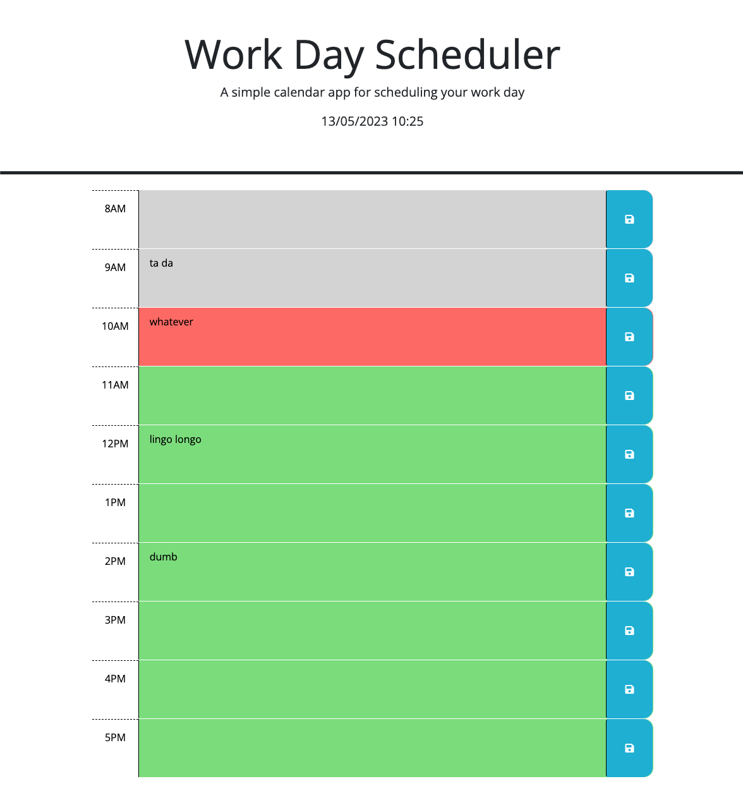

# smelly-garbage-truck
## Summary
This challenge required modifications to the starter code that would check the current date and time, set and get plans to local storage by the hours in a day, and apply a color to hours based on the time of day.

## Screenshot

## Links
<a href="https://github.com/jrdnwlkr/smelly-garbage-truck">Repository</a>
<a href="https://jrdnwlkr.github.io/smelly-garbage-truck">Live Application</a>